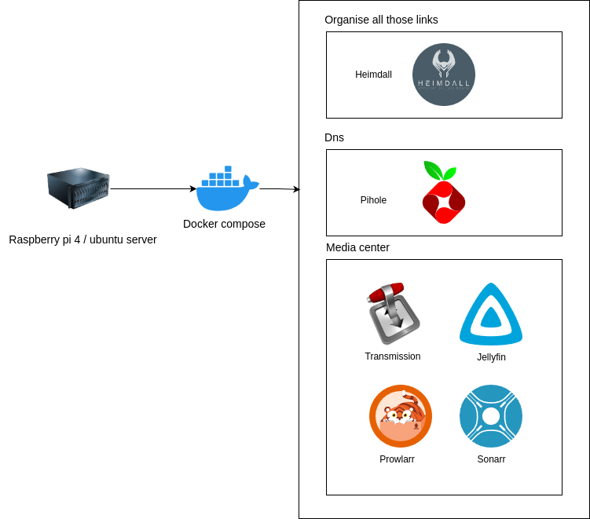

# ⚡ My small homelab 
This is my small homelab. The repository contains the configuration of my Raspberry Pi 4 server 💪

### Eschema ✏️


### configure environment file .env ⚙️
```
PIHOLE_PASS=yourpass
```

### 📁 Config Folder 
- 📁 noTranscodig: This folder contains a custom format for Sonarr that avoids downloading videos which would require transcoding on a Raspberry Pi 4.