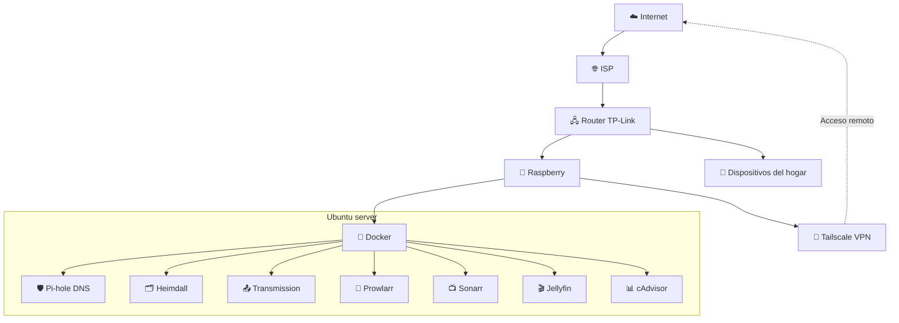

# ⚡ Mi homeserver
Este es mi servidor casero. El repositorio contiene la configuración de mi Raspberry Pi 4 💪

### Esquema ✏️

```mermaid
graph TD
    Internet[☁️ Internet]
    RouterISP[🌐 ISP]
    TPLink[🖧 Router TP-Link]
    Pi[🍓  Raspberry]
    Devices[📱 Dispositivos del hogar]
    Tailscale[🔐 Tailscale VPN]
    PiHole[🛡️  Pi-hole DNS]
    Heimdall[🗂️ Heimdall]
    Transmission[📤 Transmission]
    Prowlarr[🔎 Prowlarr]
    Sonarr[📺 Sonarr]
    Jellyfin[🎬 Jellyfin ]
    cAdvisor[📊 cAdvisor]
    Docker[🐋 Docker]

    Internet --> RouterISP --> TPLink
    TPLink --> Pi
    Pi --> Docker
    Pi --> Tailscale
    subgraph Ubuntu server
    Docker --> cAdvisor
    Docker --> Heimdall
    Docker --> PiHole
    Docker --> Transmission
    Docker --> Prowlarr
    Docker --> Sonarr
    Docker --> Jellyfin
    end
    TPLink --> Devices
    Tailscale -.->|Acceso remoto| Internet
```

### Configuración de la Raspberry
- SO: Ubuntu 24.04.04 LTS
- Configurar IP estática en `/etc/netplan/`
```yaml
# ip estática
network:
  version: 2
  ethernets:
    eth0:
      dhcp4: no
      addresses:
        - [INTERNAL_IP/24]
      routes:
        - to: default
          via: [INTERNAL_IP]
      nameservers:
        addresses:
          - 1.1.1.1
          - 8.8.8.8
```
- Deshabilitar el uso del puerto 53 en `/etc/systemd/resolved.conf.d`:
```
[Resolve]
DNSStubListener=no
```

- Montar disco duro
  - Ver UUID:
```
lsblk -f
```

Crear carpeta:

```
sudo mkdir -p /mnt/nombre
```

Editar `/etc/fstab` y agregar:

```
UUID=tu-uuid  /mnt/nombre  ext4  defaults,nofail  0  2
```

### Configuración con Ansible

Navegar al directorio `ansible/` y ejecutar:

```bash
cd ansible/
cp .env.example .env  # Configurar credenciales y rutas
bash run.sh
```

El script instala: Docker, utilitarios del sistema y Pi-hole mediante roles de Ansible.

### Variables de entorno

Crear `.env` en el directorio `ansible/`:

```env
PIHOLE_PASS=tu_contraseña
PATH_DATA=/ruta/a/datos
TAILSCALE_AUTH_KEY=tskey-auth-xxxxx
TAILSCALE_HOSTNAME=homeserver
```

### Estructura de directorios

- **ansible/**: Aprovisionamiento de infraestructura mediante roles de Ansible (system-setup, docker, pihole, tailscale)
- **services/docker/**: Configuraciones de Docker Compose con perfiles (dns, dashboard, media-download, media-streaming, infra)
- **config/**: Configuraciones personalizadas (nginx, Sonarr)
- **security/**: Guías de hardening SSH
