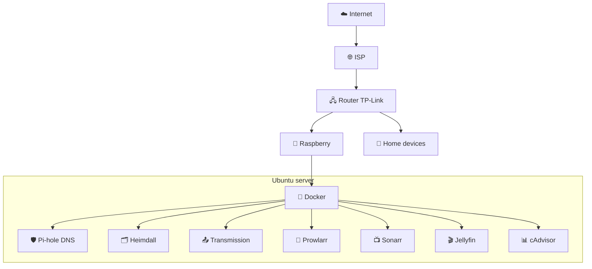
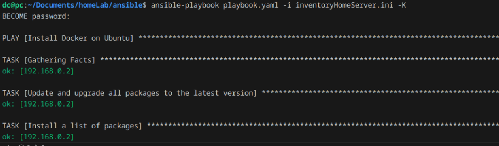

# ⚡ My small homelab 
This is my small homelab. The repository contains the configuration of my Raspberry Pi 4 server 💪

### Eschema ✏️

```mermaid
graph TD
    Internet[☁️ Internet]
    RouterISP[🌐 ISP]
    TPLink[🖧 Router TP-Link]
    Pi[🍓  Raspberry]
    Devices[📱 Home devices]
    PiHole[🛡️  Pi-hole DNS]
    Heimdall[🗂️ Heimdall]
    Transmission[📤 Transmission]
    Prowlarr[🔎 Prowlarr]
    Sonarr[📺 Sonarr]
    Jellyfin[🎬 Jellyfin ]
    cAdvisor[📊 cAdvisor]
    Docker[🐋 Docker]

    Internet --> RouterISP --> TPLink
    TPLink --> Pi 
    Pi --> Docker
    subgraph Ubuntu server
    Docker --> cAdvisor
    Docker --> Heimdall
    Docker --> PiHole
    Docker --> Transmission
    Docker --> Prowlarr
    Docker --> Sonarr
    Docker --> Jellyfin
    end
    TPLink --> Devices
```

### Config raspberry
- SO: Ubuntu 24.04.04 LTS
- Configure static ip in (/etc/netplan/)
```yaml
# static ip
network:
  version: 2
  ethernets:
    eth0:
      dhcp4: no
      addresses:
        - [INTERNAL_IP/24]
      routes:
        - to: default
          via: [INTERNAL_IP]
      nameservers:
        addresses:
          - 1.1.1.1
          - 8.8.8.8
```
- Disable the use of port 53:
In /etc/systemd/resolved.conf.d
```
[Resolve]
DNSStubListener=no
```

- Mount hdd
    - View uuid
```
lsblk -f
```

Create folder 

```
sudo mkdir -p /mnt/name
```

Edit file fstab in /etc/ and add:

```
UUID=your-uuid  /mnt/name  ext4  defaults,nofail  0  2
```

### Install packages with Ansible


```bash
ansible-playbook playbook.yaml -i inventoryHomeServer.ini -k -K
```
Flag -k: Ask for SSH password for the connection
Flag -K: Request sudo password from the user via terminal

### configure environment file .env ⚙️
```
PIHOLE_PASS=yourpass
PATH_DATA=your_disk_path
```

### 📁 Config Folder 
- 📁 noTranscodig: This folder contains a custom format for Sonarr that avoids downloading videos which would require transcoding on a Raspberry Pi 4.