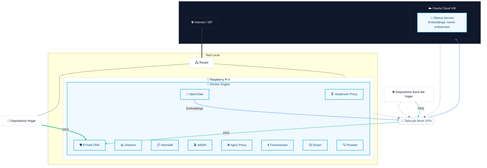

# 🏗️ Arquitectura de Red

## Topología

## Flujos de Red

### DNS (Verde)
- Todos los dispositivos locales resuelven DNS contra Pi-hole
- Dispositivos remotos via Tailscale → Pi-hole
- Pi-hole upstream: Cloudflare (1.1.1.1) y Google (8.8.8.8)

### IA (Azul)
- **Chat:** OpenClaw → Headroom (proxy :8787, comprime contexto) → DeepSeek API
- **Embeddings:** OpenClaw vía Tailscale → Ollama (nomic-embed-text) en Oracle Cloud
- Procesamiento local, modelos remotos

### VPN (Discontinuo)
- Tailscale mesh VPN conecta: Raspberry Pi, Oracle Cloud VM, dispositivos remotos
- Subnet routing para acceso a red local desde fuera

## Puertos Expuestos

| Puerto | Servicio | Acceso |
|---|---|---|
| 53 (TCP/UDP) | Pi-hole DNS | Local |
| 80 | nginx (Heimdall, OpenClaw) | Local |
| 443 | nginx HTTPS | Local |
| 8096 | Jellyfin | Local |
| 8082 | Transmission Web UI | Local |
| 8083 | Prowlarr | Local |
| 8084 | Sonarr | Local |
| 51413 (TCP/UDP) | Transmission Torrent | Local |
