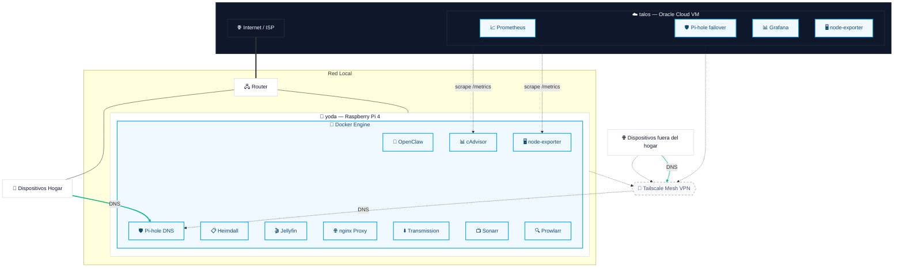

# 🏗️ Arquitectura de Red

Cómo se conectan nuestras máquinas entre sí y con el mundo. La idea de fondo es simple: todo lo importante vive en casa, la nube cubre las espaldas y nada se expone a Internet sin pasar por Tailscale.

## Índice

- [Topología](#topología)
- [Flujos de Red](#flujos-de-red)
- [Puertos Expuestos](#puertos-expuestos)

## Topología

```mermaid
graph TD
    classDef wan fill:#0f172a,stroke:#1e293b,stroke-width:2px,color:#f8fafc;
    classDef node fill:#ffffff,stroke:#cbd5e1,stroke-width:1px,color:#0f172a;
    classDef vpn fill:#f8fafc,stroke:#64748b,stroke-width:1px,stroke-dasharray: 5 5,color:#475569;
    classDef highlight fill:#f0f9ff,stroke:#0ea5e9,stroke-width:2px,color:#0c4a6e;

    subgraph WAN [ ]
        direction LR
        ISP[🌐 Internet / ISP]
        
        subgraph OCI_VM [☁️ talos — Oracle Cloud VM]
            OciPiHole[🛡️ Pi-hole failover]
            Prometheus[📈 Prometheus]
            Grafana[📊 Grafana]
            OciNodeExp[🖥️ node-exporter]
        end
    end

    Tailscale{{"🔐 Tailscale Mesh VPN"}}

    subgraph LAN [Red Local]
        Router[🖧 Router]
        subgraph Pi [🍓 yoda — Raspberry Pi 4]
            subgraph Docker [🐋 Docker Engine]
                OpenClaw[🤖 OpenClaw]
                PiHole[🛡️ Pi-hole DNS]
                cAdvisor[📊 cAdvisor]
                NodeExp[🖥️ node-exporter]
                Heimdall[📋 Heimdall]
                Jellyfin[🎬 Jellyfin]
                Nginx[🌐 nginx Proxy]
                Transmission[⬇️ Transmission]
                Sonarr[📺 Sonarr]
                Prowlarr[🔍 Prowlarr]
            end
        end
    end

    LocalDevices[📱 Dispositivos Hogar]
    RemoteNode[🌐 Dispositivos fuera del hogar]

    ISP === Router
    Router --- Pi
    Router --- LocalDevices

    Pi -.-> Tailscale
    OCI_VM -.-> Tailscale
    RemoteNode -.-> Tailscale
    
    LocalDevices ==>|DNS| PiHole
    RemoteNode -.->|DNS| Tailscale
    Tailscale -.->|DNS| PiHole

    Prometheus -.->|scrape /metrics| NodeExp
    Prometheus -.->|scrape /metrics| cAdvisor

    class WAN,ISP,OCI_VM wan;
    class Router,Pi,LocalDevices,RemoteNode node;
    class Tailscale vpn;
    class Docker,OpenClaw,PiHole,cAdvisor,OciPiHole,Heimdall,Jellyfin,Nginx,Transmission,Sonarr,Prowlarr,NodeExp,Prometheus,Grafana,OciNodeExp highlight;

    linkStyle 6,7 stroke:#10b981,stroke-width:3px;
```

> [!NOTE]
> La máquina [`anton`](HARDWARE.md#anton) (Equipo x86_64, `<ip-anton>`, pendiente de provisionar) no aparece en el diagrama: aún no tiene servicios desplegados. Se integrará cuando esté listo.

## Flujos de Red

Aquí va el resumen de cómo se mueve el tráfico entre los servicios, sin tecnicismos de más.

### DNS (Verde)
- Todos los dispositivos locales resuelven DNS contra Pi-hole
- Dispositivos remotos via Tailscale → Pi-hole
- Pi-hole upstream: Quad9 (9.9.9.9) y Cloudflare Family (1.1.1.2)

### IA
- **Inferencia:** OpenClaw → OpenRouter API (salida directa)
- Procesamiento local, modelos remotos

### VPN (Discontinuo)
- Tailscale mesh VPN conecta: [yoda](HARDWARE.md#yoda), [talos](HARDWARE.md#talos), dispositivos remotos
- Subnet routing para acceso a red local desde fuera

### Métricas (Monitoreo)
- Prometheus ([talos](HARDWARE.md#talos)) scrapea los exporters de **ambas** máquinas vía Tailscale
- [talos](HARDWARE.md#talos): node-exporter (`svcNodeExporter:9100`) y cAdvisor (`svccAdvisor:8080`) internos
- [yoda](HARDWARE.md#yoda): node-exporter (`yoda:9100`) y cAdvisor (`yoda:9101`)
- Grafana ([talos](HARDWARE.md#talos)) expone el dashboard único, accesible solo por Tailscale

## Puertos Expuestos

| Puerto | Servicio | Acceso |
|---|---|---|
| 22 | SSH | Solo LAN o Tailscale |
| 53 (TCP/UDP) | Pi-hole DNS | Local |
| 80 | nginx (Heimdall, OpenClaw) | Local |
| 443 | nginx HTTPS | Local |
| 8096 | Jellyfin | Local |
| 8082 | Transmission Web UI | Local |
| 8083 | Prowlarr | Local |
| 8084 | Sonarr | Local |
| 8085 | Pi-hole Web admin (yoda) · Radarr (anton) | Local |
| 51413 (TCP/UDP) | Transmission Torrent | Local |
| 9100 | node-exporter | Solo LAN o Tailscale |
| 9101 | cAdvisor ([yoda](HARDWARE.md#yoda)) | Solo LAN o Tailscale |
| 3000 | Grafana ([talos](HARDWARE.md#talos)) | Solo Tailscale |
