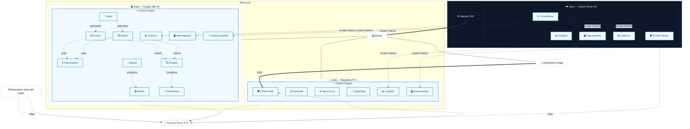

# 🏗️ Arquitectura de Red

Cómo se conectan nuestras máquinas entre sí y con el mundo. La idea de fondo es simple: todo lo importante vive en casa, la nube cubre las espaldas y nada se expone a Internet sin pasar por Tailscale.

## Índice

- [Topología](#topología)
- [Flujos de Red](#flujos-de-red)
- [Puertos Expuestos](#puertos-expuestos)

## Topología

```mermaid
graph TD
    classDef wan fill:#0f172a,stroke:#1e293b,stroke-width:2px,color:#f8fafc;
    classDef node fill:#ffffff,stroke:#cbd5e1,stroke-width:1px,color:#0f172a;
    classDef vpn fill:#f8fafc,stroke:#64748b,stroke-width:1px,stroke-dasharray: 5 5,color:#475569;
    classDef highlight fill:#f0f9ff,stroke:#0ea5e9,stroke-width:2px,color:#0c4a6e;

    subgraph WAN [ ]
        direction LR
        ISP[🌐 Internet / ISP]

        subgraph OCI_VM [☁️ talos — Oracle Cloud VM]
            OciPiHole[🛡️ Pi-hole failover]
            Prometheus[📈 Prometheus]
            Grafana[📊 Grafana]
            OciNodeExp[🖥️ node-exporter]
            OciCAdvisor[📊 cAdvisor]
        end
    end

    Tailscale{{"🔐 Tailscale Mesh VPN"}}

    subgraph LAN [Red Local]
        Router[🖧 Router]
        subgraph Pi [🍓 yoda — Raspberry Pi 4]
            subgraph DockerYoda [🐋 Docker Engine]
                PiHole[🛡️ Pi-hole DNS]
                Heimdall[📋 Heimdall]
                Nginx[🌐 nginx Proxy]
                OpenClaw[🤖 OpenClaw]
                YodaCAdvisor[📊 cAdvisor]
                YodaNodeExp[🖥️ node-exporter]
            end
        end
        subgraph Media [🎬 anton — Equipo x86_64]
            subgraph DockerAnton [🐋 Docker Engine]
                Jellyfin[🎬 Jellyfin]
                Transmission[⬇️ Transmission]
                Prowlarr[🔍 Prowlarr]
                FlareSolverr[🧩 FlareSolverr]
                Sonarr[📺 Sonarr]
                Radarr[🎞️ Radarr]
                Bazarr[💬 Bazarr]
                Seerr[📨 Seerr]
                AntCAdvisor[📊 cAdvisor]
                AntNodeExp[🖥️ node-exporter]
                Smartctl[💾 smartctl-exporter]
            end
        end
    end

    LocalDevices[📱 Dispositivos Hogar]
    RemoteNode[🌐 Dispositivos fuera del hogar]

    ISP === Router
    Router --- Pi
    Router --- Media
    Router --- LocalDevices

    Pi -.-> Tailscale
    Media -.-> Tailscale
    OCI_VM -.-> Tailscale
    RemoteNode -.-> Tailscale

    LocalDevices ==>|DNS| PiHole
    RemoteNode -.->|DNS| Tailscale
    Tailscale -.->|DNS| PiHole

    Prometheus -.->|scrape /metrics| OciNodeExp
    Prometheus -.->|scrape /metrics| OciCAdvisor
    Prometheus -.->|scrape /metrics| YodaNodeExp
    Prometheus -.->|scrape /metrics| YodaCAdvisor
    Prometheus -.->|scrape /metrics| AntNodeExp
    Prometheus -.->|scrape /metrics| AntCAdvisor
    Prometheus -.->|scrape /metrics| Smartctl

    Seerr -.->|peticiones| Sonarr
    Seerr -.->|peticiones| Radarr
    Sonarr -.->|grab| Transmission
    Radarr -.->|grab| Transmission
    Sonarr -.->|search| Prowlarr
    Radarr -.->|search| Prowlarr
    Prowlarr -.->|Cloudflare| FlareSolverr
    Bazarr -.->|subtítulos| Jellyfin

    class WAN,ISP,OCI_VM wan;
    class Router,Pi,Media,LocalDevices,RemoteNode node;
    class Tailscale vpn;
    class DockerYoda,DockerAnton,PiHole,Heimdall,Nginx,OpenClaw,OciPiHole,Jellyfin,Transmission,Prowlarr,Sonarr,Radarr,Bazarr,Seerr,FlareSolverr,YodaCAdvisor,YodaNodeExp,AntCAdvisor,AntNodeExp,Smartctl,Prometheus,Grafana,OciNodeExp,OciCAdvisor highlight;
```

## Flujos de Red

Resumen de cómo se mueve el tráfico entre los servicios.

### DNS (Verde)
- Todos los dispositivos locales resuelven DNS contra **Pi-hole de [yoda](HARDWARE.md#yoda)** (primario); [talos](HARDWARE.md#talos) es el **failover**.
- Dispositivos remotos via Tailscale → Pi-hole.
- Pi-hole upstream: Quad9 (9.9.9.9) y Cloudflare Family (1.1.1.2).

### HTTP / Web
- **nginx** ([yoda](HARDWARE.md#yoda)) es la única entrada HTTP (puerto 80): Heimdall (`/`), Pi-hole (`/pihole`, `/admin/`) y OpenClaw (`/openclaw`).
- El resto de servicios publica sus puertos solo a **LAN/Tailscale** (ver [Puertos Expuestos](#puertos-expuestos)).

### IA
- **Inferencia:** OpenClaw → OpenRouter API (salida directa). Sin puertos expuestos, solo detrás de nginx.

### Media (descarga → biblioteca)
- **Seerr** recibe las peticiones → las envía a **Sonarr/Radarr**.
- Sonarr/Radarr buscan en los indexadores de **Prowlarr** (FlareSolverr solo para los protegidos por Cloudflare), eligen release y lo envían a **Transmission**.
- Al completar, Sonarr/Radarr importan con hardlink a la biblioteca; **Jellyfin** la sirve; **Bazarr** descarga los subtítulos. Detalle en [`media/README.md`](media/README.md).

### VPN
- Tailscale mesh VPN conecta: [yoda](HARDWARE.md#yoda), [anton](HARDWARE.md#anton), [talos](HARDWARE.md#talos) y dispositivos remotos.

### Métricas (Monitoreo)
- Prometheus ([talos](HARDWARE.md#talos)) scrapea los exporters de las **tres** máquinas:
  - [talos](HARDWARE.md#talos): node-exporter (`svcNodeExporter:9100`) y cAdvisor (`svccAdvisor:8080`) internos.
  - [yoda](HARDWARE.md#yoda): node-exporter (`yoda:9100`) y cAdvisor (`yoda:9101`).
  - [anton](HARDWARE.md#anton): node-exporter (`anton:9100`), cAdvisor (`anton:9101`) y smartctl-exporter (`anton:9633`, SMART del RAID).
- Grafana ([talos](HARDWARE.md#talos)) expone el dashboard único, accesible solo por Tailscale. Detalle en [`MONITORING.md`](MONITORING.md).

## Puertos Expuestos

| Puerto | Servicio | Máquina | Acceso |
|---|---|---|---|
| 22 | SSH | todas | Solo LAN o Tailscale |
| 53 (TCP/UDP) | Pi-hole DNS | [yoda](HARDWARE.md#yoda), [talos](HARDWARE.md#talos) | Local |
| 80 | nginx (Heimdall, Pi-hole, OpenClaw) | [yoda](HARDWARE.md#yoda) | Local |
| 443 | nginx HTTPS | [yoda](HARDWARE.md#yoda) | Local |
| 3000 | Grafana | [talos](HARDWARE.md#talos) | Solo Tailscale |
| 8082 | Transmission Web UI | [anton](HARDWARE.md#anton) | LAN/Tailscale |
| 8083 | Prowlarr | [anton](HARDWARE.md#anton) | LAN/Tailscale |
| 8084 | Sonarr | [anton](HARDWARE.md#anton) | LAN/Tailscale |
| 8085 | Pi-hole Web admin | [yoda](HARDWARE.md#yoda), [talos](HARDWARE.md#talos) | LAN/Tailscale |
| 8085 | Radarr | [anton](HARDWARE.md#anton) | LAN/Tailscale |
| 8086 | Bazarr | [anton](HARDWARE.md#anton) | LAN/Tailscale |
| 8087 | Seerr | [anton](HARDWARE.md#anton) | LAN/Tailscale |
| 8096 | Jellyfin | [anton](HARDWARE.md#anton) | LAN/Tailscale |
| 51413 (TCP/UDP) | Transmission Torrent | [anton](HARDWARE.md#anton) | LAN/Tailscale |
| 9100 | node-exporter | todas | Solo LAN o Tailscale |
| 9101 | cAdvisor | todas | Solo LAN o Tailscale |
| 9633 | smartctl-exporter | [anton](HARDWARE.md#anton) | Solo LAN o Tailscale |
